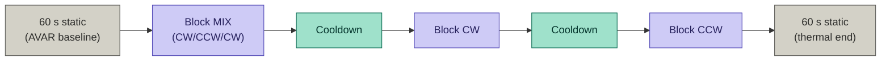
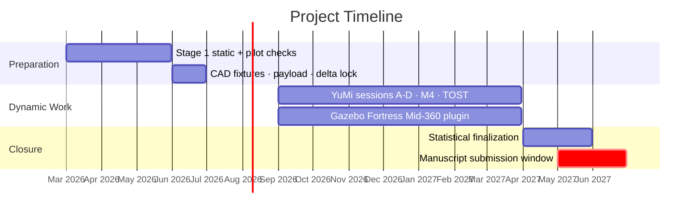

# Metrological Characterization of Robotic Sensor Noise Models: A TOST-Based Equivalence Framework for Simulation Validation

* **Author:** Narcís Abella
* **Supervisor:** Dr. Antonio Gabino Salazar Martín
* **Institution:** IQS School of Engineering (Universitat Ramon Llull), Barcelona
* **Version:** 0.6 (pending supervisor review)
* **Date:** 2026-03-31

---

## 1. What this study is and why it exists

Robotic simulators (Gazebo, Isaac Sim, Webots) use placeholder sensor noise parameters by design. The Gazebo documentation explicitly states that noise values are approximate and intended to be replaced by hardware-derived data. In practice, almost no published study performs that replacement rigorously. The dominant workaround, domain randomization, does not fix the problem: randomizing a structurally incorrect noise model generates a distribution of incorrect models, not a distribution that brackets reality [[55]](docs/REFERENCES_CONSOLIDATED.md). Aljalbout et al. [[56]](docs/REFERENCES_CONSOLIDATED.md) identify unvalidated sensor models as a structurally distinct and unresolved source of the sim-to-real gap, separate from dynamics, contact, and visual rendering. Downstream applications that depend on sensor fidelity in simulation, such as SLAM algorithm evaluation, inherit this unresolved gap.

Classical NHST cannot demonstrate equivalence: a non-significant result (p > 0.05) supports only the claim that the experiment lacked power to detect a real gap, not that the simulation is adequate. TOST inverts the burden of proof: the model must demonstrate equivalence within a pre-specified margin, not merely fail rejection [[4]](docs/REFERENCES_CONSOLIDATED.md) [[5]](docs/REFERENCES_CONSOLIDATED.md). Work in adjacent domains also uses practical-equivalence ideas [[6]](docs/REFERENCES_CONSOLIDATED.md). To the best of our knowledge, no prior work has applied this logic directly at the sensor residual level in robotics.

This study closes that gap. It uses an ABB YuMi collaborative arm (path repeatability RT = 0.10 mm [[43]](docs/REFERENCES_CONSOLIDATED.md)) as kinematic ground truth to characterize the noise statistics of three sensor families (IMU, LiDAR, RGB-D camera) under controlled dynamic conditions. It builds a family of noise models (M1 through M4) from those measurements and validates them using Two One-Sided Tests (TOST) with equivalence margins defined per sensor type in physical signal units, specified before any data collection. Equivalence is declared only when the 90% confidence interval for the mean sensor residual difference lies entirely within the pre-specified margin.

The primary outcome is sensor residuals: measured minus true (YuMi-derived) for each sensor type.

| Sensor                                        | Residual type                                                                     | Physical interpretation                                     |
| --------------------------------------------- | --------------------------------------------------------------------------------- | ----------------------------------------------------------- |
| LiDAR (RPLiDAR A2M12, Livox Mid-360)          | Point-to-plane residuals against a reference plane                                | Thermal time-of-flight drift; vibration-induced range noise |
| IMU (WT901C, Mid-360 internal, D455 internal) | Angular rate and linear acceleration residuals against YuMi kinematic derivatives | Bias; g-sensitivity; state-dependent variance               |
| Camera (RealSense D455)                       | AprilTag board pose drift under static observation                                | Thermal intrinsic drift; fixed-pattern noise                |

The detailed scientific rationale and hypotheses are in [docs/RESEARCH_PLAN.md](docs/RESEARCH_PLAN.md).

---

## 2. Hardware and ground truth

### Ground truth platform

ABB YuMi IRB 14000 IRC5 dual-arm collaborative robot. Provides kinematic ground truth for all dynamic sessions via RobotStudio-exported time-stamped flange poses.

Key ground truth parameters: path repeatability RT = 0.10 mm, path accuracy AT ≤ 1.36 mm (ISO 9283 worst-case); full specification and uncertainty interpretation in [docs/HARDWARE_PAYLOAD.md](docs/HARDWARE_PAYLOAD.md) §1 and [docs/METHODOLOGY.md](docs/METHODOLOGY.md) §2.2.

Sensor-to-flange transforms are derived from CAD-designed 3D-printed fixtures. Target poses in the laboratory frame are characterized via contact probing before each session (see §3.2).

### Sensors under test

Sessions A-D cover one sensor configuration each: IMU-only, 2D LiDAR, 3D LiDAR, visual-inertial.

| ID  | Sensor                        | Type                       | Primary session |
| --- | ----------------------------- | -------------------------- | --------------- |
| S1  | WitMotion WT901C (MPU9250)    | IMU, 200 Hz                | A               |
| S2  | RPLiDAR A2M12                 | 2D mechanical LiDAR        | B               |
| S3  | Livox Mid-360 (ICM-40609)     | 3D solid-state LiDAR + IMU | C               |
| S4  | Intel RealSense D455 (BMI055) | RGB-D + IMU                | D               |

The ICM-40609 inside the Livox Mid-360 has no independent published Allan Variance characterization in the literature. The AVAR coefficients produced by this study from Session C static logs are an original metrological contribution.

Geometry, payload mass, and arm viability analysis are in [docs/HARDWARE_PAYLOAD.md](docs/HARDWARE_PAYLOAD.md).

---

## 3. Experimental design

Full protocol details are in [docs/EXPERIMENTAL_DESIGN.md](docs/EXPERIMENTAL_DESIGN.md).

### 3.1 Stage 1: Static characterization

All sensors are fixed and immobile. No robot arm involvement.

**IMUs (S1, S3-IMU, S4-IMU):**

- 10 to 12 h static logs per IMU on a vibration-isolated surface.
- Allan Variance analysis extracts ARW, Bias Instability, and RRW per axis [[9]](docs/REFERENCES_CONSOLIDATED.md). The 10 to 12 h duration is a conservative engineering choice to improve RRW identifiability, not an absolute requirement in all setups [[11]](docs/REFERENCES_CONSOLIDATED.md).
- Six-Position Test per IEEE Std 1293 [[83]](docs/REFERENCES_CONSOLIDATED.md) for scale factor and gravitational bias characterization.
- Stationarity of each log verified via ADF or KPSS test before AVAR fitting. A non-stationary log (e.g., uncompensated thermal ramp) invalidates AVAR coefficients.
- Minimum 20-minute powered warm-up before each log [[16]](docs/REFERENCES_CONSOLIDATED.md).

**LiDAR (S2, S3):**

- Sensor faces a flat reference wall at fixed distance for 3 to 4 h.
- Point-to-plane residuals tracked as a time series to characterize thermal time-of-flight drift.

**Camera (S4):**

- D455 observes a static AprilTag board for 3 to 4 h.
- AprilTag pose drift quantifies thermal deformation of intrinsic parameters and related depth-stability effects. Supporting evidence is partly direct and partly analogous from structured-light/IR imaging literature [[34]](docs/REFERENCES_CONSOLIDATED.md), [[37]](docs/REFERENCES_CONSOLIDATED.md).

Stage 1 measurements produce the M2 (long-term Allan) noise model parameters and the thermal baseline for M4.

### 3.2 Stage 2: Dynamic sessions on YuMi

Four sessions, one sensor configuration per session.

| Session | Sensor              | Motion              | Residual computation                                                            |
| ------- | ------------------- | ------------------- | ------------------------------------------------------------------------------- |
| A       | WT901C (S1)         | 3D                  | YuMi flange angular rate + acceleration via spline differentiation              |
| B       | RPLiDAR A2M12 (S2)  | 2D planar (Z fixed) | YuMi flange pose (CAD-derived T_sensor→flange) projected to planar motion       |
| C       | Livox Mid-360 (S3)  | 3D                  | YuMi flange pose + CAD-derived T_sensor→flange                                  |
| D       | RealSense D455 (S4) | 3D                  | YuMi flange pose + CAD-derived T_sensor→flange; fixed AprilTag board for camera |

**Session structure (identical across A-D):**

Three trajectory profiles per session are used: T1 (smooth), T2 (moderate), and T3 (aggressive). Canonical session-specific nominal velocity and angular-rate values are defined in [docs/EXPERIMENTAL_DESIGN.md](docs/EXPERIMENTAL_DESIGN.md). The TOST primary endpoint uses T2. T3 is held out as the generalization check for M4.

**Sensor-to-flange transform (CAD-based):**
Sensor-to-flange transforms are derived from CAD-designed 3D-printed fixtures (SolidWorks geometry from each sensor's published CAD and the YuMi flange specification); AX=XB hand-eye calibration is not used. Per-sensor optical/inertial frame offsets are applied as fixed corrections from manufacturer documentation. Before each session, target poses are characterized via contact probing with a conical tip fixture; fixture tolerances and probing repeatability enter the uncertainty budget as Type B and Type A contributors respectively. Full protocol in [docs/EXPERIMENTAL_DESIGN.md](docs/EXPERIMENTAL_DESIGN.md) §10 and [docs/METHODOLOGY.md](docs/METHODOLOGY.md) §2.3.

**Temporal synchronization:**
PTP IEEE 1588 is the preferred synchronization method (< 1 µs accuracy). At 100 mm/s linear velocity, a 10 ms timing offset introduces 1 mm spatial projection error [[52]](docs/REFERENCES_CONSOLIDATED.md). NTP (approximately 0.2 ms accuracy) is the documented fallback; residual jitter enters the ground truth uncertainty budget as a declared contributor.

---

## 4. Noise models M1-M4

Four noise model configurations are evaluated in simulation. They form a hierarchy from current community practice to metrologically refined.

| ID  | Name                         | Parameters                                                                   | Source                                |
| --- | ---------------------------- | ---------------------------------------------------------------------------- | ------------------------------------- |
| M1  | Manufacturer                 | ARW, BI from datasheet; range sigma from datasheet                           | Sensor datasheets, community defaults |
| M2  | Static Allan                 | ARW, BI, RRW from 10 to 12 h static logs                                     | Stage 1 AVAR                          |
| M3  | In-Session Static            | ARW, BI, RRW from 60 s static windows within each dynamic session            | Stage 2 pre/post-block statics        |
| M4  | Kinematic-Residual + Thermal | $$\sigma^2(t) = f\left(T, v, \omega, a, \frac{d\omega}{dt}, \frac{da}{dt}\right)$$ fitted from YuMi residuals | Stage 2 dynamic data                  |

Manufacturer datasheets specify noise under ideal conditions: static sensor, thermally stabilized, no mechanical load. In practice, simulation pipelines often need empirically tuned inertial noise to match operational behavior [[10]](docs/REFERENCES_CONSOLIDATED.md). Lethander & Taylor [[14]](docs/REFERENCES_CONSOLIDATED.md) support treating static AVAR as a conservative lower-bound reference for some operational conditions. M1 is retained as a baseline to quantify the gap against empirically fitted models, not as a claimed operationally sufficient model.

The hierarchy has a physical interpretation grounded in measurement science. Static AVAR (M2) provides a lower bound on operational noise: operational conditions (vibration, g-sensitivity, thermal cycling) always increase noise variance above the static floor [[14]](docs/REFERENCES_CONSOLIDATED.md). M3 captures warm-up and mounting effects within a session. M4 adds the kinematic- and temperature-dependence fitted from dynamic residuals.

**M4 is an enabler for the TOST, not the primary contribution.** Its purpose is to provide sufficient simulation fidelity for the equivalence test to have statistical power within margins that are physically meaningful for sensor design decisions. Without M4, a passing TOST at M2 or M3 could reflect estimator robustness to noise mismatches rather than genuine sensor model equivalence.

The TOST is applied at every rung M1 through M4. If M2 achieves equivalence within delta, that result is reported and interpreted on its own terms: a long-term static Allan Variance characterization, accessible to any laboratory with a vibration-isolated bench and a 10 to 12 h logging session, is sufficient.

### 4.1 M4: state-dependent parametric covariance

$$\sigma^2(t) = \sigma^2_\text{static}(T(t)) + c_\omega \omega(t)^2 + c_a a(t)^2 + c_j \dot{a}(t)^2 + c_{\dot\omega} \dot{\omega}(t)^2$$

This is one of four candidate formulations evaluated empirically; the experimental study will determine which generalizes best to held-out data (see docs/METHODOLOGY.md §5.4).

where $\sigma^2_\text{static}(T) = \sigma^2_0 \exp\bigl(\alpha (T - T_\text{ref})\bigr)$ is a project modeling choice informed by thermal IMU literature [[13]](docs/REFERENCES_CONSOLIDATED.md), and $c_\omega$, $c_a$, $c_j$, $c_{\dot\omega}$ are kinematic coefficients fitted from YuMi residuals.

Coefficients are fitted on trajectories T1 and T2. T3 is held out for a generalization check. Model selection uses AIC/BIC. Collinearity is assessed by VIF; threshold VIF < 10. Fallback if collinearity persists: ridge regression with leave-one-out cross-validation.

M4 is not a new category of noise model. Learning-based state-dependent covariance estimators already exist (VIO-DualProNet [[18]](docs/REFERENCES_CONSOLIDATED.md), AirIMU [[19]](docs/REFERENCES_CONSOLIDATED.md)). M4 differs in three respects: it is an explicit parametric formula with physically interpretable coefficients, fitted from a sub-millimetre kinematic reference rather than from uncontrolled training data, and directly injectable into a deterministic simulation plugin.

Sensor-specific instantiations, candidate formula variants, and the identifiability protocol are in [docs/METHODOLOGY.md](docs/METHODOLOGY.md) §5.

---

## 5. TOST equivalence framework

This is the primary scientific contribution of the study.

### 5.1 Procedure

TOST declares equivalence by testing two one-sided null hypotheses simultaneously [[1]](docs/REFERENCES_CONSOLIDATED.md), [[2]](docs/REFERENCES_CONSOLIDATED.md):

- $H_{\text{lower}}: \mu_{\text{real}} - \mu_{\text{sim}} > -\delta$ (lower one-sided null)
- $H_{\text{upper}}: \mu_{\text{real}} - \mu_{\text{sim}} < +\delta$ (upper one-sided null)

Equivalence is declared when both are rejected at $\alpha = 0.05$, which is equivalent to the 90% confidence interval for the mean residual difference lying entirely within $[-\delta, +\delta]$.

Sample size and statistical power are computed using exact TOST power functions [[7]](docs/REFERENCES_CONSOLIDATED.md) before data collection begins. Target: $1-\beta \geq 0.80$ at $\alpha = 0.05$, with $n$ and $\sigma$ derived from Stage 1 static logs and literature values. This power analysis is a P0 blocker: sessions cannot begin until the planned $n$ achieves the required power given the chosen $\delta$.

TOST is applied independently per sensor type. Holm-Bonferroni correction is applied across the four sessions (A-D) to control the family-wise error rate.

Full mathematical procedure is in [docs/METHODOLOGY.md](docs/METHODOLOGY.md) §3.4.

### 5.2 Equivalence margin delta

The margin $\delta$ is defined per sensor type in physical signal units. It is anchored to external system requirements (task-driven navigation performance thresholds from published literature) and agreed with the supervisor before any data collection. Defining $\delta$ after inspecting data, or as a percentage of measured outcomes, invalidates the TOST.

| Sensor                                 | Residual type                    | $\delta$ units |
| -------------------------------------- | -------------------------------- | ----------- |
| LiDAR (S2, S3)                         | Point-to-plane residuals         | mm          |
| IMU gyroscope (S1, S3-IMU, S4-IMU)     | Angular rate residual            | deg/s       |
| IMU accelerometer (S1, S3-IMU, S4-IMU) | Linear acceleration residual     | m/s^2       |
| Camera (S4)                            | AprilTag pose drift: translation | mm          |
| Camera (S4)                            | AprilTag pose drift: rotation    | deg         |

Numerical values of $\delta$ are defined and locked in [docs/METHODOLOGY.md](docs/METHODOLOGY.md) §3.4 before session execution. They must not be changed after data collection begins.

---

## 6. Software contribution: Gazebo Fortress plugin for Mid-360

The Livox Mid-360 generates a non-repetitive Rosetta scan pattern via two contra-rotating Risley prisms. Standard Gazebo sensor models assume a fixed angular sampling grid and cannot reproduce this topology. The scan pattern geometry matters for simulation fidelity: non-repetitive coverage reduces degeneracy risk in low-structure environments [[24]](docs/REFERENCES_CONSOLIDATED.md), and simulating it incorrectly produces a point cloud with different structural properties than real hardware.

No standard ROS 2 Humble / Gazebo Fortress Mid-360 Rosetta plugin was identified at the study design date. The gz-sim community request for this capability has remained open since April 2023 [[81]](docs/REFERENCES_CONSOLIDATED.md). A known partial option is RobotecAI RGLGazeboPlugin [[82]](docs/REFERENCES_CONSOLIDATED.md), which targets Gazebo Harmonic and typically depends on NVIDIA OptiX/CUDA; it is therefore not the default CPU-first path for Humble/Fortress workflows in this project.

The closest prior work is Vultaggio et al. [[25]](docs/REFERENCES_CONSOLIDATED.md), who built a Gazebo Classic plugin for the Mid-360 Rosetta pattern and evaluated with generic Gaussian noise parameters. That plugin targets Gazebo Classic (EOL January 2025) and does not map directly to this project's ROS 2 Humble + Gazebo Fortress stack. The present contribution differs in three respects: Gazebo Fortress target, ROS 2 Humble compatibility, and M4 parametric state-dependent noise injection.

**Deliverable:** A Gazebo Fortress sensor plugin that:

1. Reproduces the Rosetta point distribution geometry from the Risley prism angular parameters of the Mid-360.
2. Injects M4 noise: per-point range variance as a function of instantaneous sensor kinematic state and temperature.
3. Outputs `sensor_msgs/PointCloud2` compatible with the ROS 2 Humble LTS stack.

The plugin will be released as a standalone open-source GitHub repository before paper submission, independently establishing priority on the software contribution.

---

## 7. How to read this repository

| Question                                                            | Document                                                           |
| ------------------------------------------------------------------- | ------------------------------------------------------------------ |
| Why does this study exist?                                          | This README, §1                                                    |
| Scientific rationale and hypotheses                                 | [docs/RESEARCH_PLAN.md](docs/RESEARCH_PLAN.md) §1-§4               |
| Exact experimental protocol                                         | [docs/EXPERIMENTAL_DESIGN.md](docs/EXPERIMENTAL_DESIGN.md)         |
| Statistical methodology and noise model formulas                    | [docs/METHODOLOGY.md](docs/METHODOLOGY.md)                         |
| All citations with abstracts and project relevance                  | [docs/REFERENCES_CONSOLIDATED.md](docs/REFERENCES_CONSOLIDATED.md) |
| Hardware geometry and payload analysis                              | [docs/HARDWARE_PAYLOAD.md](docs/HARDWARE_PAYLOAD.md)               |
| Current status, decisions, open blockers, and pilot session results | [PROGRESS_LOG.md](PROGRESS_LOG.md)                                 |

---

## 8. Timeline

---

## 9. Known limitations

**Time synchronization and M4.** Under the PTP target (< 1 µs clock accuracy), the spatial error contribution from timing uncertainty is < 1 µm at T3 peak velocity, negligible relative to the YuMi path repeatability floor of 0.10 mm and all dominant sources in the ground truth uncertainty budget. Studies that cannot achieve this synchronization accuracy should augment M4 with a timing-dependent bias term derived from their measured clock offset using the spatial error model of Olson (2010) [[52]](docs/REFERENCES_CONSOLIDATED.md).

**Ground truth bounds.** For dynamic trajectories, the accuracy floor is path accuracy AT ≤ 1.36 mm (ISO 9283 worst-case conditions) and path repeatability RT = 0.10 mm. Pose repeatability RP = ± 0.02 mm applies to static points only. Absolute volumetric accuracy is not characterized. The AT specification is a Type B uncertainty with no traceable calibration certificate for the IQS unit; this is declared explicitly in the uncertainty budget in [docs/METHODOLOGY.md](docs/METHODOLOGY.md) §2.2.

**TOST margin anchoring.** The equivalence margin delta must be defined externally and prior to data collection. If delta is defined post-hoc, the TOST is statistically invalid. Margin definition and supervisor agreement are a P0 blocker before YuMi booking.

**M4 identifiability.** The kinematic term of M4 includes up to five predictors $(v, \omega, a, d\omega/dt, da/dt)$ that may be collinear across the fitted trajectories. Mitigation protocol: AIC/BIC model selection, VIF < 10 threshold, ridge regression fallback with leave-one-out CV. This protocol is a P0 item that must be finalized before session execution.

**M4 scope of validity.** M4 is fitted on T1 and T2 velocities and steady-state thermal conditions. Extrapolation to T3 velocities (held-out generalization check) and cold-start transients is not validated. Extrapolation limits are declared explicitly in the experimental report.

**No spinning mechanical LiDAR.** Algorithms optimized for repetitive-scan 3D LiDARs are not tested. Extension is possible if a Velodyne or Ouster becomes available at IQS.

**Cable routing effects.** USB 3.0 (D455) and Ethernet (Mid-360) cables routed along the YuMi arm introduce variable external forces on the flange during T2/T3 trajectories. Mitigated by cable chain routing before each session; residual effect is included as a declared contributor in the ground truth uncertainty budget.

**Fixture dimensional tolerance and cross-session remounting.** Sensor-to-flange transforms are derived from CAD-designed 3D-printed fixtures. Fixture nominal tolerances (SolidWorks design) and measured tolerances (per-piece caliper measurement) are declared as Type B contributors in the uncertainty budget (METHODOLOGY.md §2.2). Cross-session remounting uncertainty is quantified via contact probing repeatability at the start of each session (≥10 independent touches; Type A contributor). The acceptance criterion for cross-session probing deviation is documented in the experimental report.

---

## 10. License

MIT License. See [LICENSE](LICENSE) for details.

Research conducted at IQS School of Engineering (Universitat Ramon Llull), Barcelona.
