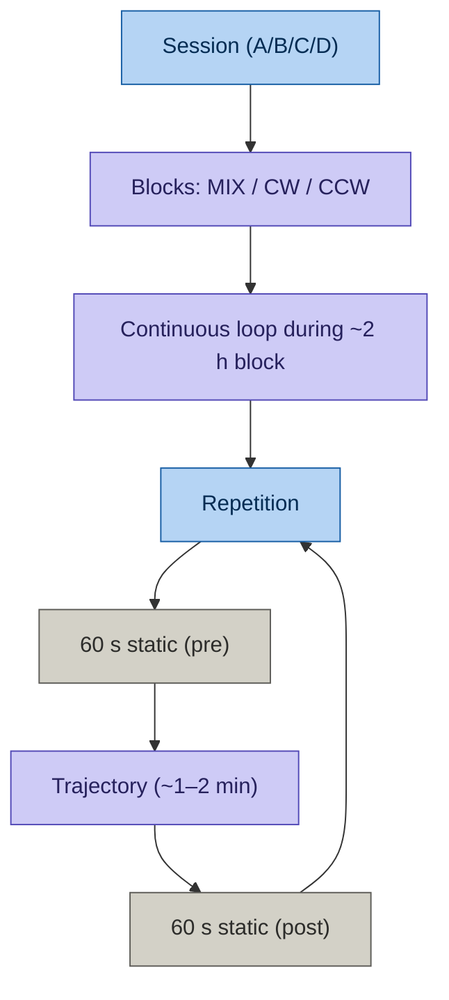
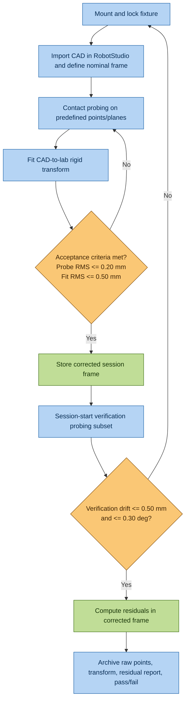

# Experimental Design

* **Version:** 0.6
* **Date:** 2026-03-31
* **Status:** Pending supervisor review and payload weight confirmation (physical scale)

---

## Table of Contents

1. [Overview and Session Structure](#1-overview-and-session-structure)
2. [Pre-Dynamic: Static Characterization](#2-pre-dynamic-static-characterization)
3. [Dynamic Sessions: Common Structure](#3-dynamic-sessions-common-structure)
4. [Session A: WitMotion WT901C (3D)](#4-session-a-witmotion-wt901c-3d)
5. [Session B: RPLiDAR A2M12 (2D)](#5-session-b-rplidar-a2m12-2d)
6. [Session C: Livox Mid-360 (3D)](#6-session-c-livox-mid-360-3d)
7. [Session D: RealSense D455 (3D)](#7-session-d-realsense-d455-3d)
8. [Controlled Environment Setup](#8-controlled-environment-setup)
9. [Temporal Synchronization Protocol](#9-temporal-synchronization-protocol)
10. [Geometric Reference Protocol (CAD + Contact Probing)](#10-geometric-reference-protocol-cad--contact-probing)

---

## 1. Overview and Session Structure

The experimental campaign is organized into **two stages**:

* **Stage 1: Static Characterization:** Independent of robot arm time. Sensors record continuously while fixed and immobile. Can be run in parallel for multiple sensors (leaving them logging overnight or over a full day). No YuMi booking required.
* **Stage 2: Dynamic Sessions:** Require exclusive access to the YuMi. Four independent sessions (A, B, C, D), one per sensor, ~8 h each.

**Total estimated robot arm time:** ~32 h (4 sessions × 8 h), plus ~1 h initial fixture probing and ~10 min geometric verification per session.

### Session summary

Sessions are ordered by modality complexity (IMU-only → 2D LiDAR → 3D LiDAR → visual-inertial):

| Session | Sensor | Payload | Motion DOF | Est. duration |
|---------|--------|---------|------------|---------------|
| A | WitMotion WT901C | ~100 g | 3D (full) | ~8 h |
| B | RPLiDAR A2M12 | ~250 g | 2D (yaw only) | ~8 h |
| C | Livox Mid-360 | ~350 g | 3D (full) | ~8 h |
| D | RealSense D455 | ~275 g | 3D (full) | ~8 h |

All sessions within YuMi payload capacity (~500 g/arm). Weight figures are estimates - **must be verified with physical scale before scheduling YuMi time.**

---

## 2. Pre-Dynamic: Static Characterization

Static characterization does **not** require the robot arm and can be completed before any dynamic session is scheduled.

### 2.1 IMU Long-Duration Static Logs

* **Sensors:** WitMotion WT901C, RealSense D455 (IMU), Livox Mid-360 (internal IMU)
* **Duration:** 10–12 h per sensor
* **Conditions:** Sensor completely immobile, mounted on anti-vibration surface
* **Temperature:** Logged every 1 h (calibrated thermometer next to sensor)
* **Goal:** Extract Allan Variance coefficients via ADEV analysis:

- $ARW$ ($^\circ/\sqrt{h}$) - from slope $-1/2$ of log-log ADEV curve
- Bias Instability ($^\circ/h$) - from minimum of ADEV curve
- $RRW$ ($^\circ/h^{3/2}$) - from slope $+1/2$ (requires full log duration; may not be identifiable in all sensors)

All coefficients reported **numerically with units and confidence intervals**, not only as curves.

* **Tooling:** `imu_utils` (ROS) or equivalent Allan Variance processing script.

---

### 2.2 Six-Position Test (IEEE Std 1293) - IMUs

* **Sensors:** WitMotion WT901C, RealSense D455 (IMU), Livox Mid-360 (internal IMU)
* **Timing:** Performed **before** long-duration static logs, on the same day
* **Procedure:** Place sensor in 6 static orthogonal orientations ($\pm X$, $\pm Y$, $\pm Z$ pointing up), ~5 min per orientation
* **Goal:** Isolate scale factor errors and gravitational bias per axis

These parameters are **not observable** from horizontal static logs and are critical for tight-coupling IMU initialization in LiDAR-inertial estimators.

---

### 2.3 LiDAR Static Characterization (Planar Orthogonal Residual Method)

* **Sensors:** Livox Mid-360, RPLiDAR A2M12
* **Setup:** Sensor fixed facing a flat wall at ~1.5–2 m distance
* **Duration:** 3–4 h (sufficient to capture thermal stabilization)
* **Method:** Fit a reference plane to the point cloud at t=0. For each subsequent frame, compute the mean and standard deviation of orthogonal distances from all points to the reference plane.

Because the reference plane is fixed at t=0 and never updated, any apparent displacement in later frames is attributable to the sensor's thermal ToF drift, not to registration errors between frames. There is no ICP matching involved.

**Do not** measure absolute distances. The goal is temporal variation, not calibration of the range measurement.

* **Warm-up requirement (Mid-360):** The Mid-360 must be powered on for a minimum of **20 minutes** before the static characterization log begins. During this warm-up period the sensor operates normally but data is not recorded for analysis. This ensures that the internal detector temperature has reached approximate thermal steady-state, so that the static thermal model $\sigma^2_{\mathrm{static}}(T)$ captures operational conditions rather than cold-start transients. The warm-up start time and ambient temperature are logged. The same 20-minute warm-up applies to all dynamic sessions (Session C).

---

### 2.4 Camera Static Characterization (RealSense D455)

* **Setup:** RealSense D455 facing a static AprilTag board (minimum 4 tags, known geometry)
* **Duration:** 3–4 h (must capture full thermal warm-up from cold start)
* **Logging:** 6-DOF pose estimation of the AprilTag board at 1 Hz
* **Goal:** Quantify:

- **Fixed-Pattern Noise (FPN)** variation in the infrared projector depth image
- **Thermal intrinsic drift:** apparent translation/rotation of the static board over time (proxy for focal length / principal point drift)

If the simulator assumes a perfect camera and the real camera shows intrinsic drift exceeding ~0.5 px (practical threshold for visual feature degradation; see Handa et al., 2014), this is a documented, quantified sim-to-real gap that provides direct motivation and a quantified bound for sensor-level equivalence testing.

---

## 3. Dynamic Sessions: Common Structure

Each dynamic session follows the same temporal structure, regardless of sensor type:

```mermaid
flowchart LR
    classDef static   fill:#D3D1C7,stroke:#5F5E5A,color:#2C2C2A
    classDef traj     fill:#CECBF6,stroke:#534AB7,color:#26215C
    classDef cooldown fill:#9FE1CB,stroke:#0F6E56,color:#04342C

    S0["60 s static"]:::static --> MIX["Block MIX (~2 h)"]:::traj
    MIX --> C1["30 min cooling"]:::cooldown
    C1 --> CW["Block CW (~2 h)"]:::traj
    CW --> C2["30 min cooling"]:::cooldown
    C2 --> CCW["Block CCW (~2 h)"]:::traj
    CCW --> S1["60 s static"]:::static
```

### Block Structure

Each block lasts approximately 2 hours. To satisfy the high statistical power required by equivalence testing (TOST, see `METHODOLOGY.md` §3.4) without extending laboratory time, the YuMi will execute the trajectory in a continuous loop pattern rather than a small fixed number of repetitions.

Each repetition is **[60 s static] → [trajectory execution, ~1–2 min] → [60 s static]**. For a ~1–2 min trajectory, a 2 h block yields **$n \approx 40$–60 independent repetitions** per block. The three blocks (MIX, CW, CCW) together give **$n \approx 120$–180 repetitions per trajectory type** (T1, T2, or T3); CW and CCW runs both count as repetitions of the same trajectory type for equivalence testing (M vs R). The sequence logic is:

| Block | Repetition pattern (continuous loop for ~2 h) |
|-------|-----------------------------------------------|
| MIX | CW, CCW, CW, CCW, CW, CCW... |
| CW | CW, CW, CW, CW... |
| CCW | CCW, CCW, CCW, CCW... |

**Purpose of this design:**

- **MIX block:** Captures alternating asymmetry and provides mixed-direction baseline.
- **CW/CCW pure blocks:** Separate unidirectional drift accumulation for CW/CCW asymmetry analysis (H2).
- **High n per trajectory type:** Enables TOST with high power (see [METHODOLOGY.md §3.4](METHODOLOGY.md)).

### Repetition Structure

The 60 s static periods at start and end of each repetition serve to:

1. Measure IMU bias before and after motion
2. Provide a zero-motion reference for ground truth alignment
3. Enable drift quantification: position/orientation error accumulated during the trajectory

### Cooling Periods

30-minute static cooling between blocks serves two purposes:

1. **Thermal recovery:** Allow sensor temperature to return toward ambient baseline
2. **Thermal characterization:** The cooling curve (temperature vs. time) documents the thermal time constant of each sensor, a parameter relevant for M4 thermal modeling

During cooling periods: log IMU and LiDAR continuously (static). **Temperature $T$** should be logged (thermometer or hardware topic) throughout the session so that the M4 thermal model $\sigma^2_{\mathrm{static}}(T)$ can be fitted. This data is useful for cross-referencing with the static characterization results.

### Cable Management During Dynamic Sessions

USB 3.0 (RealSense D455) and Ethernet (Livox Mid-360) cables must be routed along the YuMi arm using cable chain or equivalent strain-relief before each session begins. Free-hanging cables introduce variable external forces on the flange during T2/T3 trajectories that are not part of the RobotStudio kinematic model and contaminate the ground truth. This effect is documented as a known limitation and included in the ground truth uncertainty budget (see [METHODOLOGY.md §2.2](METHODOLOGY.md)).

**Protocol:**

- Route cables along the arm before the geometric reference verification check.
- Photograph the cable configuration from two angles and archive in the session log.
- Do not modify cable routing between blocks within the same session.
- If cable routing changes between sessions (e.g. different sensor, different cable length), document the change explicitly.

### Settling Time Verification (T3: Aggressive Only)

In T3 (aggressive trajectory), inter-waypoint pauses are 2 s. Before accepting these measurements as valid ground truth comparisons, we verify that the YuMi has settled mechanically:

* **Method:** During a test run, record the IMU power spectral density (PSD) during the 2 s pause. If residual vibration at the structural resonance frequency of the arm has not decayed to noise floor, the pause duration must be increased.
* **Criterion:** Vibration amplitude at pause end < $2\times$ noise floor of static IMU log (conservative threshold to ensure mechanical settling before ground truth comparison).

---

## 4. Session A: WitMotion WT901C (3D)

* **Working volume:** ~400×400×300 mm around YuMi end-effector center (same as Sessions B, C, D).
* **DOF:** Full 3D
* **Role:** IMU-only session: no LiDAR or camera. Pure inertial estimation evaluated against YuMi ground truth.

Session A serves as the **IMU-only baseline**: it quantifies how much of the sensor system residual error is attributable to IMU drift alone, before adding LiDAR or visual observations. This provides a lower bound on achievable accuracy with tight-coupling (the IMU is the weakest component in any tight-coupled system).

### Session A Trajectories T1, T2, T3 (3D)

Same profiles as Sessions C and D (smooth spherical spiral / figure-8 with Z sinus / aggressive waypoints). IMU integration error (position and orientation drift) measured against YuMi at each trajectory end.

---

## 5. Session B: RPLiDAR A2M12 (2D)

* **Constraint:** Z position is **fixed** throughout Session B. Only yaw rotation is permitted. Roll and pitch must remain at zero to avoid violating the planar scanning assumption of 2D LiDAR.
* **Working area:** XY plane, ~400×400 mm around the YuMi base reference.
* **Optional extension (separate run):** Introduce gradual Z translation to quantify the onset of planar LiDAR performance degradation: at what Z offset does the planarity assumption fail measurably? This is a potential differentiating result for publication but is not part of the core protocol.

### Trajectory T1: Smooth (2D)

* **Profile:** Rounded rectangle in XY plane, 300×300 mm, corners with radius ≥ 50 mm
* **Linear velocity:** ~20 mm/s
* **Angular velocity (yaw):** ~5°/s
* **Yaw:** Coupled to direction of motion (tangent following)
* **Purpose:** Baseline - verify that simulated 2D LiDAR matches real data under minimal dynamic stress. Reference for Bias Instability extraction under gentle motion.

### Trajectory T2: Moderate (2D)

* **Profile:** Figure-8 in XY plane, ~400×200 mm
* **Linear velocity:** ~50 mm/s
* **Angular velocity (yaw):** ~20°/s
* **Yaw:** Following tangent of the figure-8
* **Purpose:** Introduces bidirectionality intrinsically (figure-8 crosses CW and CCW arcs within a single trajectory). Tests yaw tracking under sustained moderate angular velocity.

### Trajectory T3: Aggressive (2D)

* **Profile:** Fixed waypoints in XY with step changes (point-to-point motion)
* **Linear velocity:** ~100 mm/s
* **Angular velocity (yaw):** ~45°/s
* **Yaw:** Decoupled from translation (sensor pointed at arbitrary orientations independent of motion direction)
* **Inter-waypoint pause:** 2 s (settling verification required: see §3)
* **Purpose:** Tests scanner response to rapid direction reversals and decoupled rotation. Maximum scan line density variation.

---

## 6. Session C: Livox Mid-360 (3D)

* **Working volume:** ~400×400×300 mm around YuMi end-effector center
* **DOF:** Full 3D (translation in XYZ, rotation in roll, pitch, yaw)
* **Warm-up:** Minimum 20 minutes powered-on before session start (see §2.3).

The Mid-360's internal IMU (ICM40609, 200 Hz) has factory-calibrated LiDAR-IMU extrinsics. This enables tight-coupling LiDAR+IMU in downstream estimators without additional extrinsic calibration, which reduces setup and calibration effort.

### Trajectory T1: Smooth (3D)

* **Profile:** Slow spherical spiral - the sensor traces a path that approximates uniform coverage of the working volume, analogous to a 3D Lissajous curve
* **Linear velocity:** ~15 mm/s
* **Angular velocity:** ~5°/s all axes
* **Orientation:** Coupled - sensor approximately pointing toward working volume center
* **Purpose:**

- Full Rosetta pattern integration: at low speed, the Mid-360 accumulates near-complete spherical coverage per revolution
- Reference for Bias Instability characterization under minimal dynamics
- Visual feature tracking without motion blur

### Trajectory T2: Moderate (3D)

* **Profile:** Figure-8 in XY with sinusoidal Z oscillation (~100 mm amplitude)
* **Linear velocity:** ~40 mm/s
* **Angular velocity:** ~20–30°/s
* **Yaw:** Following XY tangent
* **Pitch:** Sinusoidal, synchronized with Z (~±15°)
* **Roll:** Constant
* **Purpose:**

- Varying incidence angles on surrounding surfaces (LiDAR range accuracy as function of angle)
- Optimal parallax geometry for camera
- Moderate coupling of translational and rotational dynamics

### Trajectory T3: Aggressive (3D)

* **Profile:** Fixed 3D waypoints with step changes (point-to-point, all axes simultaneously)
* **Linear velocity:** ~80–100 mm/s
* **Angular velocity:** ~60–80°/s in roll, pitch, and yaw simultaneously
* **Rotation:** Fully decoupled from translation
* **Inter-waypoint pause:** 2 s (settling verification required)

* **Waypoint strategy options (to be decided with supervisor):**

- *Option A (fixed set):* Predefined waypoints covering the working volume. Fully reproducible but limited coverage.
- *Option B (pseudo-random with fixed seed):* Random waypoints generated from a fixed RNG seed. Broader coverage of motion space while maintaining reproducibility across sessions.

* **Purpose:** Maximum angular velocity stress test. Evaluates ARW accumulation under high-rate rotation, tests geometric degeneracy resistance of the Mid-360 Rosetta pattern under rapid reorientation. Also provides the primary dataset for empirical characterization of whether Mid-360 range-noise statistics change under controlled kinematic stress, where direct prior evidence remains limited (see [RESEARCH_PLAN.md §3.2](RESEARCH_PLAN.md)).

---

## 7. Session D: RealSense D455 (3D)

* **Working volume:** Same as Session C (~400×400×300 mm)
* **DOF:** Full 3D
* **Additional dependency:** Illumination conditions must be documented and controlled (LED stable lighting, no sunlight variation). Camera performance is directly illumination-dependent; Gazebo cannot faithfully replicate this without photorealistic rendering.

* **Note on sim-to-real gap:** Session D is expected to show the largest sensor-level sim-to-real gap of all sessions, because camera depth sensing depends on texture richness and illumination that standard Gazebo simulation does not capture. This result is expected and publishable: it directly quantifies this limitation for visual sensing.

### Trajectories T1, T2, T3 (3D)

Same profile as Session C (smooth spherical spiral / figure-8 with Z sinus / aggressive waypoints) with the same velocity and angular rate parameters. Using identical trajectories across sessions enables direct cross-sensor comparison under equivalent kinematic stress.

---

## 8. Controlled Environment Setup

The YuMi working area must be prepared to minimize uncontrolled variables that would prevent valid comparison between sessions:

| Variable | Requirement | Method |
|----------|-------------|--------|
| Geometry | Known, stable, planar surfaces within ~2–3 m (desirable but secondary) | Foam/PVC panels of known dimensions mounted on a simple frame when available; otherwise document approximate lab geometry and treat missing panels as a limitation. |
| Illumination | Stable, diffuse, temperature-stable | LED panel (constant current driver, warm-up ≥ 30 min before session) |
| Temperature | Documented, stable | Calibrated thermometer, logged at 1 h intervals; HVAC not switched during session |
| Vibration | Minimized | No mechanical activity in adjacent rooms during static characterization |
| Magnetic field | Documented | WitMotion magnetometer logs during static (cross-reference for bias); avoid metal objects being moved near sensor |
| Cable routing | Documented, strain-relieved | Cable chain along arm; photographed before each session; free-hanging cables not permitted during T2/T3 |

In practical terms, access to full geometric enclosures (foam panels or a white fabric tent) may be limited in the IQS laboratory. In this work the priority is a visually controlled environment for Session D (RealSense D455): stable illumination and simple, high-contrast patterns (AprilTag boards and mostly uniform backgrounds) that can be replicated in simulation. A more elaborate geometric enclosure for Session C (Mid-360), for example a complete cage of panels around the YuMi, is desirable but not required for the core metrological results; if only partial panels are available, this is documented explicitly as a limitation in the dynamic LiDAR range (≈0.4–3 m) and in the Discussion.

Preferred location: If a metrology or optics laboratory with better-controlled conditions is available at IQS, it should be prioritized at least for the static characterization sessions. If not available, this is declared as an explicit limitation and documented as motivation for a controlled-environment follow-up.

---

## 9. Temporal Synchronization Protocol

At ~100 mm/s linear velocity, a 10 ms clock offset between the YuMi IRC5 controller and the ROS PC introduces ~1 mm of artificial spatial error. This is non-negligible relative to the YuMi's path repeatability (0.10 mm) and must be explicitly addressed before any trajectory comparison is considered valid.

Preferred method: PTP (IEEE 1588 Precision Time Protocol) between YuMi IRC5 and ROS PC, if supported by the network configuration.

Fallback: NTP synchronization with explicit jitter measurement and documentation.

In all cases, the synchronization method used, the measured time offset, and the measured jitter must be reported. The spatial error contribution from timing uncertainty ($v_{\max} \times \Delta t$) must be computed and included in the ground truth uncertainty budget.

Reviewers are likely to flag this if it is not addressed explicitly.

---

## 10. Geometric Reference Protocol (CAD + Contact Probing)

RobotStudio provides the pose of the YuMi mechanical flange. Sensor residual computation must be expressed in a fixed laboratory geometric frame that is independent of sensor self-estimation. The active protocol in this work is a **fixture-based geometric reference** built from nominal CAD geometry and corrected with **contact probing** before dynamic sessions.

### 10.1 Active Geometric Reference Workflow

**Reference elements:**

1. A rigid fixture anchored in the YuMi workspace with known CAD geometry
2. A set of geometric primitives used as references (planes, edges, and corner control points)
3. A contact probe routine executed by the robot to identify actual fixture geometry in the lab frame

The full step-by-step sequence is shown in the Mermaid flowchart above; Sections 10.2 and 10.3 define acceptance criteria and session-level verification.

### 10.2 Measurement and Acceptance Criteria

The contact probing dataset is accepted only if both conditions are satisfied:

- Probe point repeatability (same point, repeated touches): $\mathrm{RMS} \leq 0.20$ mm
- CAD-to-probed rigid fit residual over the control set: $\mathrm{RMS} \leq 0.50$ mm

If any criterion fails, repeat probing after checking fixture locking, probe tip condition, and robot approach velocity.

### 10.3 Session-Level Verification

At the start of each dynamic session, before any trajectory data is recorded:

1. Execute a short verification probing pass on a reduced subset of fixture control points.
2. Recompute the local CAD-to-lab correction.
3. Compare against the stored baseline correction.
4. Accept the session only if frame drift is $\leq 0.50$ mm translation and $\leq 0.30$ deg rotation.

If the verification fails, re-seat the fixture and re-run the full probing workflow from Section 10.1.

### 10.4 Data Archival

Archive the following in `data/calibration/` for each session:

- CAD model version and fixture ID
- Raw contact probing points (timestamped)
- Fitted CAD-to-lab transform and residual report
- Session-level verification result (pass/fail)

This provides a complete audit trail for reviewers and keeps geometric reference definition fully tied to fixture CAD plus contact probing.
